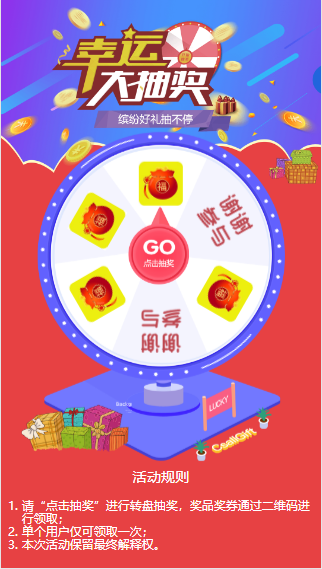

# 转盘抽奖
转盘抽奖，在 h5 页面中还是比较常见的，并且用 css+js，vue，react 分别实现了。

## 页面截图（vue、react）

vue、react 实现的效果一致，只是运用了不同的框架。其中 vue 实现的已经应用于实际，而 react 实现的算是“练手”。

## 页面截图（css+js）

用 css 布局实现转盘效果，包括闪烁的灯、转盘、指针等，没有应用任何图片，js 实现抽奖效果。目的是练习自己的基本功，css布局 + 原生js的能力。

## 项目预览
1. [vue 版](https://esnail.github.io/turntable/vue-turntable/dist/index.html)
2. [css + 原生 js](https://esnail.github.io/turntable/css-js-turntable/index.html)
3. [react 版](https://esnail.github.io/turntable/react-turntable/build/index.html)